# DECISION_120: Google Jules Integration for OpenCode

**Strategist:** Pyxis  
**Nexus:** Requested 2026-03-01  
**Category:** INTEGRATION  
**Status:** Approved → Implementation Ready
**Implementation Target:** `packages/console/app/src/lib/jules/` (OpenCode integration)
**Research Base:** `OP3NF1XER/opencode-jules/docs/specs/` (9 research documents)

---

## Executive Summary

**Current Problem:**
OpenCode users need the ability to delegate complex coding tasks to AI agents. While OpenCode supports various AI providers (Anthropic, OpenAI, Google Gemini), it lacks integration with Google's Jules - a specialized AI coding agent that provides session-based task execution, GitHub repository integration, and automatic PR creation.

**Proposed Solution:**
Build a **two-phase Jules integration** within OpenCode:

**Phase 1 (Stateless Proxy):**
- REST API client for Jules API (`jules.googleapis.com/v1alpha`)
- Session lifecycle management (create → poll → approve → complete)
- Direct integration with OpenCode provider stack
- Location: `packages/console/app/src/lib/jules/`

**Phase 2 (SSE-Native Agentic Run):**
- In-memory watcher that polls Jules and publishes `jules.*` bus events
- OpenCode-compatible SSE event stream
- "Agentic Run" IDE panel with timeline, plan/to-do, and artifacts
- Truth-first UX: events are truth, UI keepalive is clearly labeled
- Addresses GitHub issues #6627, #9649, #9650

**Key Innovation:**
Unlike external PR approach (10 files, 0 modifications), this implementation enables:
- Full OpenCode integration with existing provider stack
- SSE event bus integration for real-time updates
- Session lifecycle mapping (QUEUED → PLANNING → APPROVAL → EXECUTION → COMPLETION)
- Truth-first UX with verifiable progress tracking
- Future extensibility for multi-agent workflows

---

## Background

### Current State
- OpenCode has multiple specialized agents with defined responsibilities
- OpenCode has a unified AI provider adapter pattern supporting Anthropic, OpenAI, Google (Gemini), and OpenAI-Compatible formats
- Google Jules API (jules.googleapis.com/v1alpha) provides session-based coding agent capabilities
- OpenCode uses event-driven architecture with SSE for real-time updates
- **Research completed:** 9 reference documents in `docs/specs/`

### Desired State
- OpenCode users can delegate complex coding tasks to Jules via standardized interface
- Jules sessions are tracked with activity monitoring
- Results from Jules (PRs, code changes) are integrated back into development workflow
- **SSE-native UX:** Real-time updates via event bus (not polling)
- **Truth-first design:** Events are truth, UI keepalive is explicitly labeled
- Authentication and rate limiting are managed centrally

### Research Foundation

**Location:** `OP3NF1XER/opencode-jules/docs/specs/`

| Document | Purpose | Key Insight |
|----------|---------|-------------|
| `01-NOTES_AI_Provider_Architecture.md` | Codemap analysis | ProviderHelper is wrong abstraction for Jules |
| `02-NOTES_normalizeJulesToRun.md` | API normalization | Jules sessions map to OpenCode session lifecycle |
| `03-NOTES_keepalive copy generator.md` | UX design | Dead-air filler must be explicitly labeled |
| `04-NOTES_Thinking_Pipeline.md` | Event taxonomy | jules.* event naming convention |
| `05-NOTES_agentic_run_page_jules_tsx_skeleton.md` | UI structure | Solid/TSX panel structure for Agentic Run |
| `06-SPEC-SSE_Parallel_to_Planned_Feature.md` | SSE integration | Addresses GitHub #9650 (sessionID filtering) |
| `07-ADR-Jules_Agentic_Run.md` | Architecture decision | Two-phase: stateless proxy → SSE-native watcher |
| `08-ARCH-Jules_Provider_Integration.md` | Provider integration | Standalone client architecture |
| `09-BRIEF-Community_Issues_SSE_and_Multi_Agent.md` | Community alignment | GitHub issues #6627, #9649, #9650 |

---

## Specification

### Two-Phase Architecture

#### Phase 1: Core Jules Client (Foundation)
Stateless REST client for Jules API with OpenCode session integration.

| ID | Requirement | Priority | Description |
|----|-------------|----------|-------------|
| JULES-001 | API Client Implementation | Must | Create Jules API client (standalone, not ProviderHelper) |
| JULES-002 | Authentication Management | Must | Secure API key storage and header injection |
| JULES-003 | Session Lifecycle | Must | Create, monitor, and complete Jules sessions |
| JULES-004 | Activity Tracking | Must | Poll and store Jules activities in OpenCode format |
| JULES-005 | Source Management | Should | List and validate GitHub sources/repos |
| JULES-006 | Plan Integration | Should | Map Jules plans to OpenCode action items |
| JULES-007 | Result Retrieval | Must | Extract PRs, patches, and outputs from completed sessions |
| JULES-008 | Error Handling | Must | Handle 401/403/429/500 with retry and fallback |
| JULES-009 | Rate Limiting | Should | Respect Jules rate limits with exponential backoff |
| JULES-010 | Entity Mapping | Must | Map Jules responses to OpenCode entities (hybrid storage) |

#### Phase 2: SSE-Native Agentic Run (Innovation)
In-memory watcher publishing `jules.*` events to OpenCode-compatible SSE stream.

| ID | Requirement | Priority | Description |
|----|-------------|----------|-------------|
| JULES-011 | Event Bus Integration | Must | Publish `jules.*` events to OpenCode event bus |
| JULES-012 | Watcher Service | Must | In-memory poller with bounded cadence |
| JULES-013 | SSE Event Stream | Must | Compatible with OpenCode `/event` endpoint pattern |
| JULES-014 | Truth-First UX | Must | Events are truth; UI keepalive is explicitly labeled |
| JULES-015 | SessionID Filtering | Should | Support filtering by openCodeSessionID (addresses #9650) |
| JULES-016 | Reconnect Resilience | Must | Rehydrate state on SSE reconnect |
| JULES-017 | Artifact Streaming | Should | Stream activities/artifacts as they complete |
| JULES-018 | Dead-Air Handling | Must | UI keepalive never claims unverified actions |

### Technical Details

**Jules API Specification:**
- Base URL: `https://jules.googleapis.com/v1alpha`
- Authentication: `x-goog-api-key` header
- Resources: Sources, Sessions, Activities
- Session States: QUEUED → PLANNING → AWAITING_PLAN_APPROVAL → IN_PROGRESS → COMPLETED/FAILED

**OpenCode Provider Adapter Pattern:**
From codemap analysis, the system uses:
- `ProviderHelper` interface: modifyUrl, modifyHeaders, modifyBody, createUsageParser, normalizeUsage
- `createBodyConverter`: from/to format transformations
- Provider selection via ZenData.list() and selectProvider()
- Google format falls through to OA-Compatible transformations

**Integration Points:**
1. **packages/console/app/src/lib/jules/** - Core API client
2. **packages/console/app/src/routes/zen/util/provider/jules.ts** - Provider implementation
3. **packages/web/src/components/agentic-run/** - UI components
4. **docs/specs/** - Architecture specifications
5. **OpenCode integration** - Zen handler/provider stack

---

## Action Items

### Phase 1: Core Jules Client

| ID | Action | Assigned To | Status | Priority |
|----|--------|-------------|--------|----------|
| ACT-001 | Create JulesTypes.ts - type definitions | WindFixer | Pending | High |
| ACT-002 | Create JulesConfig.ts - configuration | WindFixer | Pending | High |
| ACT-003 | Create IJulesClient.ts + JulesClient.ts - HTTP client | WindFixer | Pending | High |
| ACT-004 | Create JulesSessionManager.ts - lifecycle orchestration | WindFixer | Pending | High |
| ACT-005 | Create JulesEntityMapper.ts - entity mapping | WindFixer | Pending | High |
| ACT-006 | Create JulesAuthAdapter.ts - auth integration | WindFixer | Pending | Medium |
| ACT-007 | Add JulesSession/JulesActivity entities to MongoDB | WindFixer | Pending | High |
| ACT-008 | Add Jules repositories to IUnitOfWork | WindFixer | Pending | Medium |
| ACT-009 | Write unit tests for Jules client | WindFixer | Pending | Medium |
| ACT-010 | Create integration tests with live Jules API | WindFixer | Pending | Low |

### Phase 2: SSE-Native Agentic Run

| ID | Action | Assigned To | Status | Priority |
|----|--------|-------------|--------|----------|
| ACT-011 | Create JulesWatcher service (in-memory poller) | WindFixer | Pending | High |
| ACT-012 | Implement jules.* event taxonomy | WindFixer | Pending | High |
| ACT-013 | Integrate with OpenCode event bus | WindFixer | Pending | High |
| ACT-014 | Build Agentic Run IDE panel (Solid/TSX) | WindFixer | Pending | Medium |
| ACT-015 | Implement truth-first UX (events vs keepalive) | WindFixer | Pending | Medium |
| ACT-016 | Add sessionID filtering support | WindFixer | Pending | Low |
| ACT-017 | Create reconnect resilience logic | WindFixer | Pending | Medium |
| ACT-018 | Write SSE event stream tests | WindFixer | Pending | Medium |

### Documentation & Contribution

| ID | Action | Assigned To | Status | Priority |
|----|--------|-------------|--------|----------|
| ACT-019 | Create GitHub issue for OpenCode (reference #6627) | Pyxis | Pending | Low |
| ACT-020 | Document architecture for external contribution | Pyxis | Pending | Low |
| ACT-021 | Update agent prompts with Jules delegation guidance | Pyxis | Pending | Medium |
| ACT-022 | Create decision handoff template for Jules tasks | Pyxis | Pending | Low |

---

## Dependencies

**Blocks:**
- None (new capability)

**Blocked By:**
- API key acquisition from jules.google.com/settings
- Repository access via Jules GitHub app installation

**Related:**
- DECISION_038: Multi-Agent Decision-Making Workflow
- DECISION_039: ToolHive Migration
- Existing OpenCode provider adapter infrastructure

---

## GitHub Issue Alignment

**Community Feature Requests Addressed:**

| Issue | Title | Relevance | How We Address It |
|-------|-------|-----------|-------------------|
| [#6627](https://github.com/anomalyco/opencode/issues/6627) | Delegate to Coding Agent? | **Primary** | Jules integration enables exactly this - delegate coding tasks to Google's AI agent |
| [#9649](https://github.com/anomalyco/opencode/issues/9649) | Multi-Agent Coding | **Secondary** | Jules acts as external coding specialist; can be one agent in a multi-agent ensemble |
| [#9650](https://github.com/anomalyco/opencode/issues/9650) | SSE sessionID Filter | **Related** | Jules sessions will generate events; proper session filtering enables better multi-session support |

**Alignment Strategy:**
Our implementation directly addresses the community's #1 request for coding agent delegation. Rather than building a custom coding agent, we integrate with Google's Jules - a mature, purpose-built coding agent with:
- Session-based task execution
- GitHub repository integration  
- Plan-based code generation
- Automatic PR creation

**Philosophical Alignment:**
- ✅ **Small, focused PR** (10 new files, 0 modifications)
- ✅ **Stateless design** respects Cloudflare Worker constraints
- ✅ **No new infrastructure** - uses existing Hono route patterns
- ✅ **AGENTS.md compliance** matches project culture
- ✅ **Test coverage** demonstrates quality commitment

**PR Description Strategy:**
Reference issue #6627 explicitly: "This PR implements support for Google Jules integration, addressing the coding agent delegation feature requested in #6627."

---

## Risks and Mitigations

| Risk | Likelihood | Impact | Mitigation |
|------|------------|--------|------------|
| Jules API alpha instability | High | Medium | Wrap with circuit breaker, fallback to local agents |
| Rate limiting (429 errors) | Medium | Medium | Implement exponential backoff, queue Jules requests |
| Authentication key exposure | Low | High | Store in MongoDB encrypted, inject via headers only |
| Session polling overhead | Medium | Low | Use webhook if available, else 30s polling with jitter |
| Format incompatibility with adapter | Medium | Medium | Jules uses JSON/REST, may not fit streaming adapter pattern |

---

## Success Criteria

1. **Jules client can**: Create session, poll activities, retrieve results, handle errors
2. **OpenCode integration**: Sessions tracked, linked to parent sessions
3. **Agent delegation**: At least one agent (Forgewright) can delegate to Jules via decision contract
4. **Error resilience**: 429/500 errors handled with retry, circuit breaker functional
5. **Security**: API key never logged, stored encrypted, transmitted only via header
6. **Test coverage**: 80%+ unit test coverage for Jules client

---

## Token Budget

| Phase | Estimate | Model | Category |
|-------|----------|-------|----------|
| Client implementation | 50K | Claude 3.5 Sonnet | INTEGRATION |
| Integration & tests | 30K | Claude 3.5 Sonnet | INTEGRATION |
| Documentation & handoff | 10K | GPT-4o Mini | DOCUMENTATION |
| **Total** | **90K** | Mixed | INTEGRATION |

---

## Bug-Fix Section

**Error Handling Protocol:**
- 401: Log auth failure, halt (don't retry with bad key)
- 403: Log permission error, check GitHub app installation
- 429: Exponential backoff (1s → 2s → 4s → 8s), max 5 retries
- 500: Immediate retry once, then circuit breaker open for 5 min
- Network errors: 3 retries with jitter

**Circuit Breaker Settings:**
- Failure threshold: 5 errors in 60 seconds
- Cooldown: 5 minutes
- Half-open test: Single request, close on success

---

## Sub-Decision Authority

| Agent | Can Create | Scope | Approval |
|-------|-----------|-------|----------|
| Oracle | Validation sub-decisions | Risk assessment | Assimilated |
| Designer | Architecture sub-decisions | Client design | Assimilated |
| WindFixer | Implementation sub-decisions | C# client code | Required (Pyxis) |
| OpenFixer | Config/tooling sub-decisions | Auth, CLI | Required (Pyxis) |

---

## Consultation Log

### Oracle Consultation
**Status:** Pending  
**Questions:**
1. Risk assessment of Jules API alpha stability
2. Rate limiting impact on OpenCode throughput
3. Security boundaries for API key handling

### Designer Consultation
**Status:** Pending  
**Questions:**
1. Architecture fit with existing provider adapter pattern
2. Session polling vs webhook design
3. Entity mapping between Jules and OpenCode models


## Architecture Diagram

```mermaid
flowchart LR
    subgraph Components["JULES INTEGRATION COMPONENTS"]
        direction TB
        
        1["**1. IJulesClient**<br/>Interface<br/>• CreateSession()<br/>• GetSession()<br/>• ListActivities()<br/>• SendMessage()<br/>• ApprovePlan()"]
        
        2["**2. JulesApiClient**<br/>HTTP/REST Implementation<br/>• Base URL: jules.googleapis.com/v1alpha<br/>• Auth: x-goog-api-key header<br/>• Retry logic (429/500)<br/>• Circuit breaker"]
        
        3["**3. JulesSessionManager**<br/>Lifecycle & Polling<br/>• Session state tracking<br/>• Activity polling (30s)<br/>• Result extraction<br/>• Error recovery"]
        
        4["**4. Entities**<br/>MongoDB Storage<br/>• JulesSession (id, state, prompt)<br/>• JulesActivity (originator, artifacts)<br/>• PullRequest output<br/>• GitPatch extraction"]
        
        5["**5. Repository**<br/>IRepoJulesSession<br/>• CRUD operations<br/>• Query by state<br/>• Parent decision linking<br/>• Historical lookup"]
        
        6["**6. CLI Tool**<br/>Invoke-JulesSession.ps1<br/>• Direct API access<br/>• Testing & debugging<br/>• One-off task execution<br/>• Result export"]
        
        7["**7. Agent Delegation**<br/>Forgewright Integration<br/>• Decision → Jules session<br/>• Plan approval routing<br/>• Result → action items<br/>• Fallback handling"]
        
        8["**8. Google Jules API**<br/>External Service<br/>• Sessions endpoint<br/>• Activities endpoint<br/>• Sources endpoint<br/>• GitHub integration"]
    end
    
    style 1 fill:#e94560,stroke:#16213e,stroke-width:2px,color:#fff
    style 2 fill:#e94560,stroke:#16213e,stroke-width:2px,color:#fff
    style 3 fill:#e94560,stroke:#16213e,stroke-width:2px,color:#fff
    style 4 fill:#533483,stroke:#16213e,stroke-width:2px,color:#fff
    style 5 fill:#533483,stroke:#16213e,stroke-width:2px,color:#fff
    style 6 fill:#16213e,stroke:#e94560,stroke-width:2px,color:#fff
    style 7 fill:#0f3460,stroke:#16213e,stroke-width:2px,color:#fff
    style 8 fill:#4285f4,stroke:#ea4335,stroke-width:2px,color:#fff
```




- Source: `c:\P4NTH30N\OP3NF1XER\opencode-jules\google-jules\`
- Files reviewed: overview.md, quickstart.md, authentication.md, activities.md, sessions.md, types.md, sources.md
- Key finding: Jules uses `x-goog-api-key` header (same as Google Gemini in provider adapter)
- API structure: RESTful with resource names (sessions/{id}, sources/{id})

**Provider Adapter Pattern Relevance:**
- Jules API is REST-based, not streaming
- May not directly fit `ProviderHelper` streaming interface
- Recommendation: Create standalone Jules client, not adapter integration
- Reuse: Authentication pattern (x-goog-api-key), error handling, retry logic

**ExternalDocs Archive:**
- Documents retrieved to: `c:\P4NTH30N\ExternalDocs\google-jules\`
- Sources: jules.google/docs/api/reference/*

---

## Implementation Contract (OpenCode Integration)

### Phase 1: Core Jules Client

**Delivered:**
```
packages/console/app/src/routes/zen/util/provider/jules.ts
├── Wire types: JulesStatus, JulesSessionResponse, JulesActivityResponse, JulesArtifactResponse
├── IDE model: Run, RunPhase, RunEvent, RunPlanStep, Artifact
├── Client interface: IJulesClient (6 operations)
├── Normalizer: normalizeJulesToRun(prev, input) — 5-step pipeline
├── Evidence matcher: upgradeStepsWithEvidence(run)
├── Keepalive: generateTruthfulKeepalive(run, now)
└── Poll config: POLL constants (2s/5s/10s/1h/360 max)
```

**Remaining Phase 1:**
```
packages/console/app/src/lib/jules/
├── index.ts                    # Public API exports
├── types.ts                    # Jules API types
├── config.ts                   # Configuration
├── client/
│   ├── JulesClient.ts          # HTTP/REST implementation
│   ├── schemas.ts              # Zod validation schemas
│   └── errors.ts               # Jules-specific errors
├── routes/
│   └── jules.ts                # Hono route handlers (stateless)
└── __tests__/
    ├── client.test.ts          # HTTP client tests
    ├── schemas.test.ts         # Validation tests
    ├── config.test.ts          # Config tests
    └── routes.test.ts          # Route handler tests
```

### Phase 2: SSE-Native Agentic Run

**Target Files:**
```
packages/console/app/src/lib/jules/
├── watcher/
│   ├── JulesWatcher.ts         # In-memory poller + event publisher
│   └── JulesEventTypes.ts      # jules.* event taxonomy
└── sse/
    └── JulesEventBusIntegration.ts  # Event bus wiring

packages/console/app/src/routes/
└── jules-watch.ts              # Watcher control routes

packages/web/src/components/agentic-run/
├── AgenticRunPanel.tsx         # Solid/TSX IDE panel
├── Timeline.tsx                # Truth stream timeline
├── PlanTodoList.tsx            # Plan → To-Do
├── ArtifactViewer.tsx          # PR/patch display
└── KeepaliveIndicator.tsx      # UI-only keepalive (labeled)
```

**Validation Commands:**
```bash
# Install dependencies
bun install

# Type check
bun run typecheck

# Run Jules tests
bun test packages/console/app/src/lib/jules/__tests__/

# Lint (AGENTS.md style)
bun run lint

# Manual test
curl -H "x-goog-api-key: $JULES_API_KEY" \
  http://localhost:8787/v1/jules/sources
```

---

*Decision updated with Oracle assessment. Status: CONDITIONAL (52/100). Ready for implementation handoff.*

---

## Oracle Assessment Summary

**Assessment filed by:** Provenance (Oracle)  
**Location:** `c:\P4NTH30N\OR4CL3\assessments\2026-03-01-DECISION_120.md`  
**Composite Risk Score:** 52/100 (MODERATE)  
**Status:** CONDITIONAL — Upgrade to CLEAR pending 6 conditions

### Critical Architecture Pivot: Stateless Proxy (Option D)

Oracle determined that **Cloudflare Worker constraints eliminate all storage options except stateless proxy:**

| Option | Verdict | Reason |
|--------|---------|--------|
| File-based JSON | ❌ Eliminated | Workers have no filesystem |
| LocalStorage | ❌ Eliminated | Server-side route handlers, no browser context |
| In-memory | ⚠️ Unreliable | Workers evict between requests |
| **Stateless Proxy** | ✅ **Recommended** | Jules API holds state; server is authenticated pass-through |
| Cloudflare KV | ⚠️ Phase 2 only | Too invasive for first PR (requires SST/wrangler changes) |

**Storage Risk with Option D:** 35/100 (LOW)

### The 6 Red Lines (Blocks Approval)

🔴 **No GitHub issue before PR** — will be closed without review  
🔴 **AI-generated PR description** — maintainers will denounce  
🔴 **Modifying existing provider files** — instant rejection on first PR  
🔴 **Server-side persistent state** — no new DB tables, no file I/O, no KV bindings  
🔴 **No tests** — project culture demands them  
🔴 **Using any type** — AGENTS.md is explicit  

### Conditions for CLEAR Status

1. ✅ GitHub issue created and acknowledged before PR
2. ✅ Stateless proxy approach (Option D)
3. ✅ New files only — zero existing file modifications
4. ✅ Minimum 4 test files
5. ✅ Human-written PR description < 200 words
6. ✅ Full AGENTS.md style compliance

### API Stability Strategy (72/100 HIGH)

Jules v1alpha has active churn (repoless sessions, file outputs, activity filters added Jan 2026). REST reference last updated 2025-10-02 — docs lag reality by 4+ months.

**Defensive Patterns:**
- Version-pin `/v1alpha/`
- Validate response shapes with Zod at runtime
- Preserve raw JSON verbatim
- Use feature detection over assumption
- Circuit-break on 3+ unexpected responses
- Isolate all HTTP calls in single `JulesClient.ts` file

### PR Quality Minimum Requirements

| Requirement | Standard | Evidence |
|-------------|----------|----------|
| Test coverage | 4-6 test files minimum | 46+ existing test files set the bar |
| Test approach | No mocks per AGENTS.md | Test pure functions, not implementation |
| Documentation | Issue-first policy | CONTRIBUTING.md explicit |
| PR description | Human-written, < 200 words | Include curl-based manual test |
| Code style | No any, no try/catch, no else | Full AGENTS.md compliance |
| Backwards compatibility | New files only | Zero modifications to handler.ts, provider.ts, google.ts |

### Target Repository Constraints

- **Repository:** https://github.com/anomalyco/opencode
- **First PR:** Yes — papertrail must be perfect
- **Deployment:** Cloudflare Workers via SST
- **Default branch:** `dev` (not `main`)
- **Style authority:** `AGENTS.md` in repo root

---

## Revised Implementation Contract (Stateless Proxy)

### Architecture Principle
> *"The server becomes a thin authenticated proxy. Jules holds the state. The client drives the lifecycle. The first PR is small, clean, and testable."* — Provenance

### Target Files (OpenCode Repository)

```
packages/console/app/src/lib/jules/
├── index.ts                    # Public API exports
├── types.ts                    # Jules API types (generated from docs)
├── config.ts                   # Configuration (env var based)
├── client/
│   ├── JulesClient.ts          # HTTP/REST implementation (single file)
│   ├── schemas.ts              # Zod validation schemas
│   └── errors.ts               # Jules-specific errors
├── routes/
│   └── jules.ts                # Hono route handlers (stateless)
└── __tests__/
    ├── client.test.ts          # HTTP client tests
    ├── schemas.test.ts         # Validation tests
    ├── config.test.ts          # Config defaults
    └── routes.test.ts          # Route handler tests
```

**Total New Files:** 10  
**Modified Files:** 0 (zero existing file modifications)

### Route Design (Stateless)

```typescript
// packages/console/app/src/lib/jules/routes/jules.ts
// Stateless — no storage, no sessions, no persistence

POST /v1/jules/sessions          // Proxy to Jules API
GET  /v1/jules/sessions/:id      // Proxy to Jules API
GET  /v1/jules/sessions/:id/activities  // Proxy to Jules API
POST /v1/jules/sessions/:id/approve     // Proxy to Jules API
POST /v1/jules/sessions/:id/message     // Proxy to Jules API
GET  /v1/jules/sources           // Proxy to Jules API
```

All routes:
1. Extract `x-goog-api-key` from request header (or env var)
2. Forward to `jules.googleapis.com/v1alpha`
3. Return raw Jules response (verbatim JSON preservation)
4. No transformation, no storage, no state

### Configuration (Environment Only)

```typescript
// config.ts — no files, no KV, no storage
interface JulesConfig {
  apiKey: string | null      // from JULES_API_KEY env var
  baseUrl: string            // https://jules.googleapis.com/v1alpha
  timeoutMs: number          // 30000
  maxRetries: number         // 3
}
```

### AGENTS.md Compliance Checklist

- [ ] No `any` type — use `unknown` + type guards
- [ ] No `try`/`catch` — use early returns + error types
- [ ] No `else` statements — early return pattern
- [ ] No destructuring — dot notation: `obj.a`, `obj.b`
- [ ] Single word names: `client`, not `julesClient`
- [ ] `const` only — no `let`, use ternaries
- [ ] Bun APIs: `Bun.file()`, `Bun.env`
- [ ] Functional methods: `flatMap`, `filter`, `map` with type guards

### Validation Commands (OpenCode Repo)

```bash
# Install dependencies
bun install

# Type check
bun run typecheck

# Run Jules tests only
bun test packages/console/app/src/lib/jules/__tests__/

# Lint (AGENTS.md style)
bun run lint

# Manual test
curl -H "x-goog-api-key: $JULES_API_KEY" \
  http://localhost:8787/v1/jules/sessions
```

---

## Implementation Progress

### Branch: `chasing-jules`
**Commit:** 28a5c919a — feat: add jules provider module, architecture doc, and deployment journals  
**Delivered by:** Aegis (Designer)  
**Status:** Milestones 1-3 Complete (5 files, 1,346 insertions)

### Milestone 1 — Research & Specifications ✅
**Location:** `docs/specs/` (7 spec docs, 3,326 lines)

| Spec | Document | Purpose |
|------|----------|---------|
| 01 | `01-NOTES_AI_Provider_Architecture.md` | Provider architecture analysis |
| 02 | `02-NOTES_normalizeJulesToRun.md` | Decision lifecycle mapping |
| 03 | `03-NOTES_keepalive copy generator.md` | UX keepalive design |
| 04 | `04-NOTES_Thinking_Pipeline.md` | Event taxonomy |
| 05 | `05-NOTES_agentic_run_page_jules_tsx_skeleton.md` | UI structure |
| 06 | `06-SPEC-SSE_Parallel_to_Planned_Feature.md` | SSE integration spec |
| 07 | `07-ADR-Jules_Agentic_Run.md` | Architecture decision record |

**Key Deliverables:**
- Canonical IDE data model (Run, RunPhase, RunEvent, Artifact, RunPlanStep)
- Normalizer pipeline (`normalizeJulesToRun`)
- Keepalive generator (`generateTruthfulKeepalive`)
- Thinking pipeline UI layout
- TSX skeleton with mock client
- SSE event taxonomy (`jules.*` events)
- ADR for phased delivery

### Milestone 2 — Architecture Decision ✅
**Location:** `docs/specs/08-ARCH-Jules_Provider_Integration.md` (177 lines)

**Key Decisions:**
- ✅ Jules does NOT fit ProviderHelper adapter pattern (6 assumption mismatches documented)
- ✅ File structure for Phase 1 routes + Phase 2 watcher
- ✅ Domain module contents defined
- ✅ Polling architecture diagram
- ✅ Truth-first UX constraints (6 hard rules)
- ✅ Relationship to existing Zen handler/provider stack

### Milestone 3 — Jules Provider Implementation ✅
**Location:** `packages/console/app/src/routes/zen/util/provider/jules.ts` (813 lines)

**Module Contents:**
- **Wire types:** `JulesStatus`, `JulesSessionResponse`, `JulesActivityResponse`, `JulesArtifactResponse`
- **IDE model:** `Run`, `RunPhase`, `RunEvent`, `RunPlanStep`, `Artifact`
- **Client interface:** `IJulesClient` — 6 operations (create, get, listActivities, approve, reject, cancel)
- **Normalizer:** `normalizeJulesToRun(prev, input)` — 5-step pipeline with deduplication, plan preservation, active step heuristic
- **Evidence matcher:** `upgradeStepsWithEvidence(run)` — file match (10pts), dir match (6pts), token overlap (3pts/hit), threshold ≥10
- **Keepalive:** `generateTruthfulKeepalive(run, now)` — phase-aware, truth-only confidence, rotation cadence per phase
- **Poll config:** POLL constants (2s/5s/10s/1h/360 max)

**Architecture Decisions Validated:**
1. Jules lives alongside Zen, not inside it — no ProviderHelper implementation
2. `jules.ts` in `provider/` for colocation; consumed directly by `routes/jules/` (Phase 1) and future watcher (Phase 2)
3. Truth-first UX: timeline = truth events only; keepalive = UI-only, never claims unverified actions
4. Phase 1 = client-driven polling via stateless proxy routes → Phase 2 = server-side watcher with bus events over SSE

### Deployment Journals ✅

| Journal | Location | Milestone |
|---------|----------|-----------|
| M1 Research | `docs/deployment/journals/JOURNAL_2026-03-01_DECISION_120_M1_RESEARCH_SPECS.md` | Research & Specs |
| M2 Architecture | `docs/deployment/journals/JOURNAL_2026-03-01_DECISION_120_M2_ARCHITECTURE.md` | Architecture Decision |
| M3 Provider | `docs/deployment/journals/JOURNAL_2026-03-01_DECISION_120_M3_JULES_PROVIDER.md` | Provider Implementation |

---

## Papertrail Status

| Artifact | Location | Status |
|----------|----------|--------|
| Decision document | `docs/DECISION_120_Google_Jules_Integration.md` | ✅ Complete |
| Research base | `docs/specs/` (9 documents) | ✅ Complete |
| Architecture spec | `docs/specs/08-ARCH-Jules_Provider_Integration.md` | ✅ Complete |
| ADR | `docs/specs/07-ADR-Jules_Agentic_Run.md` | ✅ Complete |
| SSE Spec | `docs/specs/06-SPEC-SSE_Parallel_to_Planned_Feature.md` | ✅ Complete |
| Oracle assessment | `docs/oracle/2026-03-01-DECISION_120.md` | ✅ Complete |
| Designer architecture | `docs/specs/08-ARCH-Jules_Provider_Integration.md` | ✅ Complete |
| **M1 Research** | `docs/specs/01-07` | ✅ **Delivered** |
| **M2 Architecture** | `docs/specs/08-ARCH-*` | ✅ **Delivered** |
| **M3 Provider** | `packages/console/app/src/routes/zen/util/provider/jules.ts` | ✅ **Delivered** |
| Strategist handoff | `docs/HANDOFF_120_A_Strategist_to_Designer.md` | ✅ Complete |
| Implementation handoff | `docs/HANDOFF_120_B_Strategist_to_Implementation.md` | ✅ Complete |
| GitHub issue alignment | Issues #6627, #9649, #9650 | ✅ Identified |
| Community issues brief | `docs/specs/09-BRIEF-Community_Issues_SSE_and_Multi_Agent.md` | ✅ Complete |
| **Phase 1 Remaining** | Proxy routes + tests | 🔄 Next |
| **Phase 2** | SSE watcher + IDE panel | ⏳ Blocked by #9650 |
| External contribution | OpenCode PRs (#9650, #14114, #6142) | ⏳ Ready to propose |

---

## Handoff to Implementation

**Assigned to:** OpenFixer / WindFixer (TypeScript implementation)  
**Source material:**
- `OP3NF1XER/opencode-jules/docs/specs/08-ARCH-Jules_Provider_Integration.md` (Designer spec)
- `OP3NF1XER/opencode-jules/docs/specs/09-BRIEF-Community_Issues_SSE_and_Multi_Agent.md` (Oracle brief)
- `OP3NF1XER/opencode-jules/docs/jules-api/*.md` (Jules API docs)
- `OP3NF1XER/opencode-jules/packages/opencode/AGENTS.md` (Style guide)

**Non-negotiables:**
1. Zero modifications to existing files in `packages/console/app/src/`
2. All Jules code isolated to `packages/console/app/src/lib/jules/`
3. Stateless proxy — no storage, no state, no persistence
4. Zod validation for all Jules API responses
5. 4+ test files with no mocks
6. Human-written PR description < 200 words

**Red line verification:** Before submission, run `grep -r "any\|try\|catch\|else {" packages/console/app/src/lib/jules/` — should return nothing.

**First PR significance:** This is a significant contribution to OpenCode. The papertrail must be perfect. The implementation must be small, clean, and demonstrate respect for the project's culture.

---

**Handoff prepared by:** Pyxis (Strategist)  
**Date:** 2026-03-01  
**Status:** Ready for implementation  
**Next milestone:** GitHub issue creation → Implementation → PR submission
